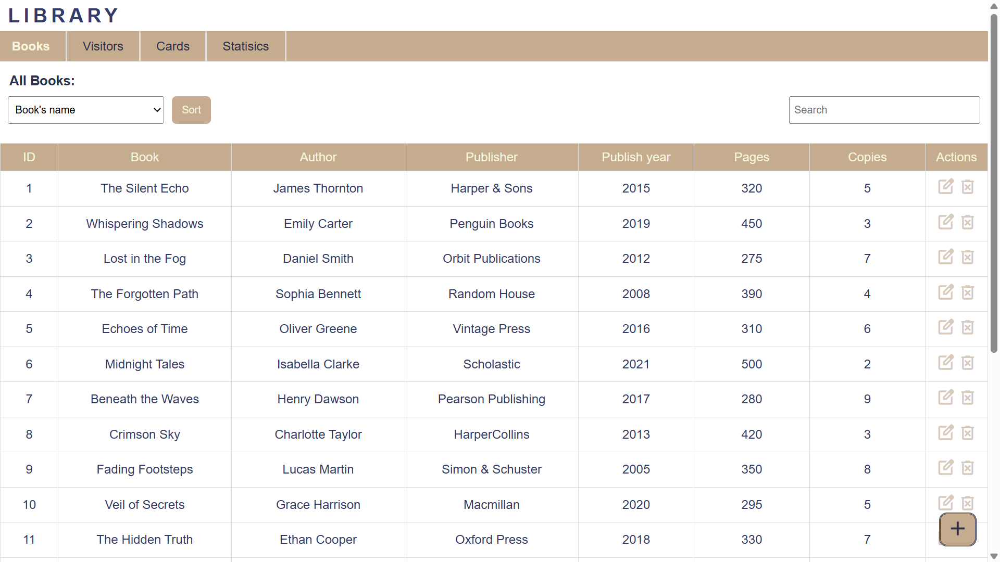
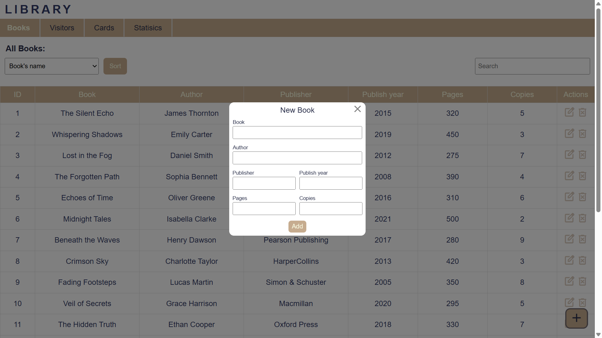
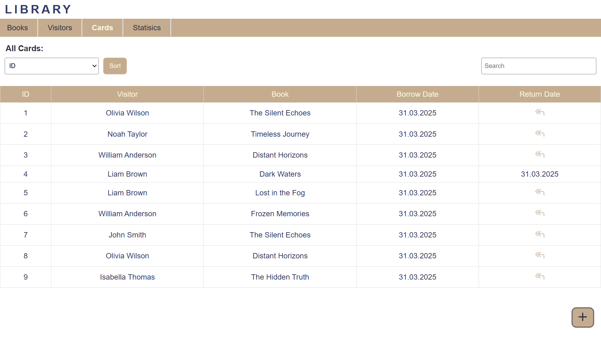
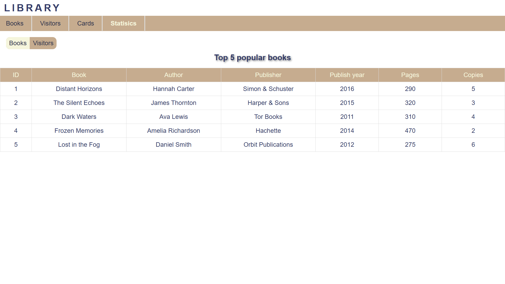
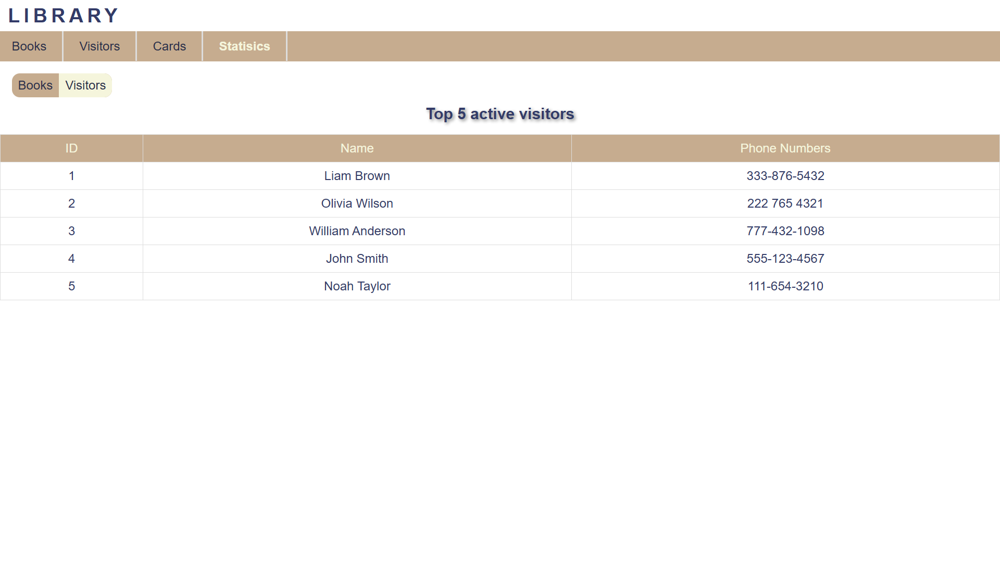

# **Library Management System**

A lightweight library management web application, allows librarian to keep track of books, visitors, and borrowing records.

## Features

- **Book management**: Add, edit, delete, sort, and search through the library's book collection

- **Visitor management**: Keep track of visitors with their information and allows add, edit, delete, sort, and search for visitor

- **Card system**: Track borrowed books and returns with automated date

- **Statistic**: View the most popular books and active visitors

- **Data**: All data is stored in browser's local storage

## Website link

https://library-website-omega.vercel.app/

## Demo

Book page interface showing book's control and detail

Card page interface displaying borrowed book records and control

Statistic dashboard showing popular books and visitors

